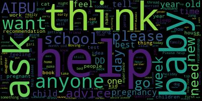

# Assistive-Typing Technology

A small proof of concept assistive technology which aids in the curation of shitposts. It provides drop-down suggestions of what to type while you type.

## Libraries

 * [markovify](https://github.com/jsvine/markovify)
 * [prompt\_toolkit](https://github.com/jonathanslenders/python-prompt-toolkit)

## Sources

 * erowid
 * mumsnet
 * literotica
 * ...

## Example

## TODO

 * Screencast demo
 * categories
 * topic conversation

